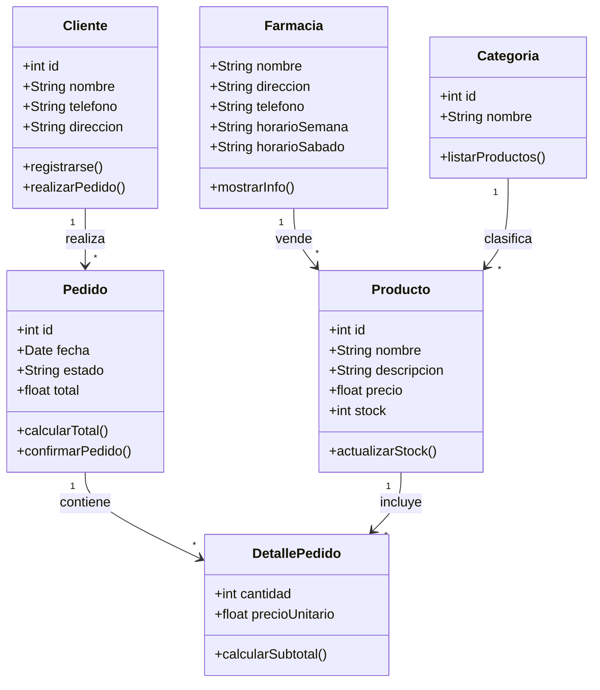

# Parte 2 - Modelo del dominio: Farmacia Tapia

## Análisis del negocio

Farmacia Tapia es una farmacia de barrio que actualmente no cuenta con página web ni redes sociales. El objetivo de la nueva web es ofrecer un catálogo de productos para que los clientes puedan ver el stock disponible y realizar pedidos de forma más sencilla, ampliando el alcance más allá del barrio.

## Entidades principales

- **Farmacia**: el negocio en sí, con su información de contacto y horarios.
- **Categoría**: agrupa los productos del catálogo (ej. medicamentos, higiene, cuidado personal).
- **Producto**: cada ítem que se vende, con su precio y stock.
- **Cliente**: quien navega el catálogo y realiza pedidos.
- **Pedido**: la orden generada por un cliente.
- **DetallePedido**: cada línea de un pedido (producto + cantidad).

## Diagrama de clases

## Relaciones entre clases

| Clase origen | Relación | Clase destino |
|---|---|---|
| Farmacia | vende (1 a muchos) | Producto |
| Categoria | clasifica (1 a muchos) | Producto |
| Cliente | realiza (1 a muchos) | Pedido |
| Pedido | contiene (1 a muchos) | DetallePedido |
| Producto | incluido en (1 a muchos) | DetallePedido |
